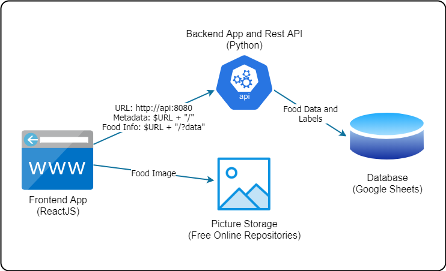

# Nutripedia 

## About

**Nutripedia** is a nutritional catalog with food information, like properties, benefits, composition, action, and nutrients.

## Technology

The system consists of three layers:
- **Frontend App**: using [ReactJS](https://reactjs.org/), a JavaScript library for building user interfaces. With it, we can develop an application able to run in a browser, both on desktop and mobile, with no necessity to install an app.
- **Backend App and API**: 
- **Storage**: 

