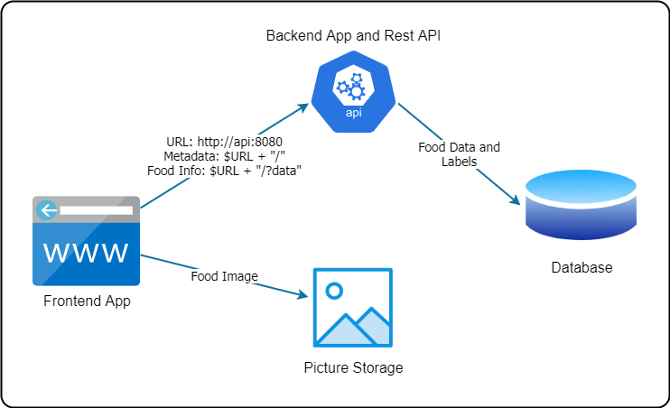

# Nutripedia 

## About

**Nutripedia** is a nutritional catalog with food information, like properties, benefits, composition, action, and nutrients.

## Technology

The system consists of three layers:
- **Frontend App**: using [ReactJS](https://reactjs.org/), a JavaScript library for building user interfaces. With it, we can develop an application able to run in a browser, both on desktop and mobile, with no necessity to install an app.
- **Backend App**: using [Python](https://www.python.org/), a programming language that lets you work quickly and integrate systems more effectively. On Python, there is a lot of modules that help you to consume and to provide remote services.
- **Storage**:
  - *Data*: [Google Sheets](https://www.google.com/sheets/about/) is a free online spreadsheet application for creating and using in a collaborative way. In this data storage, food information, like values and metadata, is available to show to end-users.
  - *Pictures*: to don't storage the food images on the local repository and make the solution expensive, free image addresses are made available on the same spreadsheet of food data.

